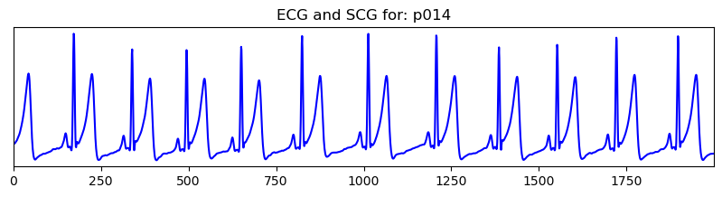

# Basic Tutorial for the method presented in IEEE/ACM CHASE2025 publication: Cross-Dataset Validation of a Sensor Agnostic Sesimocardiography Peak Detection Method

* In this example we will show how to apply the given method to an SCG signal snippet as an example
* The full pipeline for each dataset can be found in notebook form in the pipeline_notebooks.zip file.
* Paper link: https://ieeexplore.ieee.org/abstract/document/11121120
* Citation: I. Elnaggar et al., "Cross-Dataset Validation of a Sensor Agnostic Seismocardiography Peak Detection Method," _2025 IEEE/ACM Conference on Connected Health: Applications, Systems and Engineering Technologies (CHASE)_, New York, NY, USA, 2025, pp. 395-400. doi:10.1145/3721201.3724416.
* <b> For question/comments please contact Ismail Elnaggar via email: imelna@utu.fi <b>


```python
#standard imports
import numpy as np
from scipy import signal
import neurokit2 as nk
import pandas as pd
import matplotlib.pyplot as plt

```


```python
#lets import the functions from our .py files we need in order to run our method
from svmd_ismail import *
from ismail_peak_detect import *
from data_parser_ismail import *
```

### We will import the CEBS dataset as a dictionary resampled to 200 hz for this tutorial. 


```python
scg_data=data_parser("/home/SCG/Open_data_2024/Formatted_Datasets/Formatted_CEBSDB_Data",
                      sampling_freq=5000,ecg_key="ECG1",scg_key="Acc_Z")
```

### First we can do a quick visual inspection of a few signals.
* This will give us an idea of what our SCG signals look like for though who are unfamiliar with this type of biosignal. 


```python
Fs=200
f1=10
f2=30
sos = signal.butter(8,[f1,f2],fs=(Fs),btype='bandpass',output='sos')

t1=30*Fs
t2=40*Fs
for i in ["b001","p014"]:
    print("PLOTTING DATA FROM MEASUREMENT:",i)
    #SCG
    scg_zaxis=scg_data[i]["Acc_Z"]
    #filtering
    scg_zaxis=scg_zaxis-np.mean(scg_zaxis)
    scg_zaxis=signal.sosfiltfilt(sos,scg_zaxis,axis=0)
    scg_zaxis=scg_zaxis/np.std(scg_zaxis)

    #ECG
    ecg_data=scg_data[i]["ECG1"]
    #filtering
    ecg_data=nk.ecg_clean(ecg_data,sampling_rate=Fs)
    
    plt.figure(figsize=(10,2))
    plt.title("ECG and SCG for: {0}".format(i))
    plt.plot(ecg_data[t1:t2],c="b")
    plt.margins(x=0)
    plt.yticks([])
    plt.show()

    plt.figure(figsize=(10,2))
    plt.plot(scg_zaxis[t1:t2],c="r")
    plt.margins(x=0)
    plt.yticks([])
    plt.show()
```

    PLOTTING DATA FROM MEASUREMENT: b001
    


    PLOTTING DATA FROM MEASUREMENT: p014
    





* So right away we can see that the SCG Z-axis signal has these periodic waveforms that coincide with the QRS complexes in the ECG signal. We are lucky because these signals are relatively high quality. Evenso because SCG or seismocardiography is measuring chest acceleration we can expect the signal to be much more noisy when compared to ECG.

# Time Frequency Vizualization 
* I want to do this to try to see the frequency bands where the noise is most dominant and how strong it is relative to the heart beat signal in our SCG. Most of these signals still show some distinct peaks, so i'm thinking that the SCG heart beat features likely occupy separate frequency bands from the noise. But even if the dominant frequencies differ, some overlap or subtle interference may still be present so i need to consider this somehow...
* I'm going to do my visualization by applying a continous wavelet transform to the raw signals and then vizualize the spectogram produced by the cwt.


```python
Fs=200
f1=10
f2=30
sos = signal.butter(8,[f1,f2],fs=(Fs),btype='bandpass',output='sos')
my_scales=scale_selecter(scales=(f1,f2,.1),fs=Fs)

t1=30*Fs
t2=40*Fs
for i in ["b001","p014"]:
    print("PLOTTING DATA FROM MEASUREMENT:",i)
    #SCG
    scg_zaxis=scg_data[i]["Acc_Z"]
    #filtering
    scg_zaxis=scg_zaxis-np.mean(scg_zaxis)
    scg_zaxis=signal.sosfiltfilt(sos,scg_zaxis,axis=0)
    scg_zaxis=scg_zaxis/np.std(scg_zaxis)
    scg_zaxis=scg_zaxis[t1:t2] #take a 10 second segment
    
    plt.figure(figsize=(10,3))
    plt.title("Filtered SCG Z-axis ID {0}".format(i))
    plt.plot(scg_zaxis)
    plt.margins(x=0)
    plt.yticks([])
    plt.show()

    my_cwt,f=cwt_waveform_maker(scg_zaxis,my_scales,wavelet_name="morl",fs=200,abs_val=True)
    t=np.arange(len(scg_zaxis))
    plt.figure(figsize=(10,3))
    plt.title("CWT of Filtered Sig from {0} to {1} Hz".format(f1,f2))
    plt.pcolormesh(t, f, np.abs(my_cwt), shading='auto')
    plt.yticks(np.arange(min(f), max(f)+1, 10))
    plt.margins(x=0)
    plt.yticks([])
    plt.show()

    

```

    PLOTTING DATA FROM MEASUREMENT: b001
    


    PLOTTING DATA FROM MEASUREMENT: p014
    


### Thoughts on visual inspection of spectograms
* Okay so these are filtered signals, Even though there seems to be some noise in the signals I can still see high frequency energy lines that coincide with the visual peaks in the filtered signal which are our heart beats.
* So i want to apply some techniques that minimize the frequency or energy displayed in the frequency bands that don't represent SCG heart beat complexes.. I'm going to use a type of mode decompisition (successive variational mode decomposition (SVMD)) that you can apply to a signal so that the signal is decomposed into a set of signals that represent the original signal, these modes will try to capture the periodic "oscillations" which are representing the heart beat complexes in the signal. This decomposition should also in theory not capture the noise in the signal especially this background diffuse noise present throughout the signal.
* One important downside is the assumption that the noise present in the signal will be mostly separated from the signal. In signals that are very noisy or have motion artifact spikes, this method can fail. This should be considered when deciding to apply this method or some type of motion artifact pre-processing to remove these types of artifacts should be applied to the signals before svmd

### SVMD Visualization 

* The first main step in the method is to apply a SVMD to our SCG signal to try to better extract our Heart beat locations. This is inportant because our actual peak detection method will require clean peaks to accurately identify real heart beats. 


```python

#init signal keys and filtering ranges
ecg_axis="ECC1"
axz ="Acc_Z"
f1=10
f2=30
fs=200
Fs=200
sos = signal.butter(8,[f1,f2],fs=(Fs),btype='bandpass',output='sos')
sos2 = signal.butter(8,[5,35],fs=(Fs),btype='bandpass',output='sos')

#time segment to plot
t1=30*Fs
t2=40*Fs
for p in ["b001","p014"]:
    
    
    my_data=scg_data[p][axz]
    test_arrz=my_data-np.mean(my_data)
    test_arrz=signal.sosfiltfilt(sos,test_arrz,axis=0)
    
    t1=30*Fs
    t2=40*Fs
    test_arrz=test_arrz[t1:t2]
    
    
    modes = svmd(test_arrz**2, alpha=2000, tol=1e-6,max_iter=10,max_modes=6)
    
    # Reconstruct AO signal
    reconstructed_ao = reconstruct_signal(modes, threshold=1.0)
    reconstructed_ao=reconstructed_ao-np.mean(reconstructed_ao)
    reconstructed_ao=signal.sosfiltfilt(sos2,reconstructed_ao,axis=0)
    
    num_modes = len(modes)
    
    fig, axes = plt.subplots(num_modes + 2, 1, figsize=(10, 6 + 2 * num_modes))
    
    axes[0].set_title("Original Signal {0}".format(p))
    axes[0].plot(test_arrz, color="blue")
    axes[0].grid(True)
    
    # Plot each mode in its own subplot
    for i, mode in enumerate(modes):
        axes[i + 1].set_title(f"Mode {i + 1}")
        axes[i + 1].plot(mode, color="orange")
        axes[i + 1].grid(True)
    
    # Plot reconstructed AO signal
    axes[-1].set_title("Reconstructed AO Signal")
    axes[-1].plot(reconstructed_ao, color="green")
    axes[-1].grid(True)
    
    # Adjust layout
    plt.tight_layout()
    plt.show()
```

    C:\Users\imelna\anaconda\envs\emgEnv\AS_Notebooks\Open_data_2024\Peak_Detection_Testing\github_test\svmd_ismail.py:71: RuntimeWarning: divide by zero encountered in scalar divide
      if np.linalg.norm(new_mode - mode) / np.linalg.norm(mode) < tol:
    


### svmd output observations
* We can see here that the mode decomposition and reconstruction of the signal from the modes removes a lot of the extra noise in the signal
* It looks like we're able to preserve the heart beats, but i'm not 100% sure if we're keeping all the peaks.
* So best way to test this in this case is to run it on some signals and see if our mean heart rate detected from our peaks are similar to the ground truth heart rates.
* To do the peak detection I'm going to apply a envelope creation method and a peak detection method to extract an envelope and the relevant peaks from the reconstructed signal. This is the second main step of the method. Where we apply a CWT to the output of our SVMD decomposition and reconstruction. We will then apply some filtering to our CWT to again produce a 1-d signal. This will be our signal where we actually apply our AMPD based peak detection to. 
  

# Continious wavelet transform (CWT) based envelope creation and automatic multiscale-based peak detection (AMPD). 
* The cwt envelope extraction is based on this paper : https://cinc.org/archives/2022/pdf/CinC2022-364.pdf , it's not an exact replica but the core ideas are from this study.
* The ampd peak detection method is based on this paper: https://www.mdpi.com/1999-4893/5/4/588 , again it's not an exact replica but the main ideas come from here.
* These ideas are stored in ismail_peak_detect.py file
* Basically the ismail_peak_detect.py functions take this reconstructed signal you can see in the above cells and produce an envelope signal. This envelope signal will be the signal that we actually use to detect peaks from. We basically create a 1-d array from the 2-d CWT matrix to try to accurately identify peak locations associated with heart beats. 

## Full Pipeline Vizualization applied on 10 second segments 
* Note in practice this method works better when you segment the signal into chunks of X seconds long. I would not recommend applying this pipeline as it currently is written directly to signals that are many minutes or hours long


```python

#init signal keys and filtering ranges
ecg_axis="ECC1"
axz ="Acc_Z"
f1=10
f2=30
fs=200
Fs=200
sos = signal.butter(8,[f1,f2],fs=(Fs),btype='bandpass',output='sos')# first bp filter before mode decomposition
sos2 = signal.butter(8,[5,35],fs=(Fs),btype='bandpass',output='sos') # second bp filter after signal reconstruction and before envelope creation.
#get scales, scales used to create the CWT from the reconstructed signal.
my_scales=scale_selecter(scales=(f1,f2,.1),fs=fs)


#time segment to plot
t1=30*Fs
t2=40*Fs
for p in ["b001","p014"]:
    
    
    my_data=scg_data[p][axz]
    test_arrz=my_data-np.mean(my_data)
    test_arrz=signal.sosfiltfilt(sos,test_arrz,axis=0)
    
    # take 10 second segment
    test_arrz=test_arrz[t1:t2]
    
    
    modes = svmd(test_arrz**2, alpha=2000, tol=1e-6,max_iter=10,max_modes=6)
    
    # Reconstruct AO signal
    reconstructed_ao = reconstruct_signal(modes, threshold=1.0)
    reconstructed_ao=reconstructed_ao-np.mean(reconstructed_ao)
    reconstructed_ao=signal.sosfiltfilt(sos2,reconstructed_ao,axis=0)
    my_envcwt,plocs = ie_peak_detector(reconstructed_ao, Fs, my_scales)
    
    fig, axes = plt.subplots(3, 1, figsize=(10, 6))
    
    axes[0].set_title("Original Signal {0}".format(p))
    axes[0].plot(test_arrz, color="red")
    axes[0].vlines(plocs, ymin=np.min(test_arrz), ymax=np.max(test_arrz), color="blue", linestyle="--")
    
    axes[1].set_title("Reconstructed Signal")
    axes[1].plot(reconstructed_ao, color="purple")
    axes[1].vlines(plocs, ymin=np.min(reconstructed_ao), ymax=np.max(reconstructed_ao), color="blue", linestyle="--")

    #plot env signal and plocs AO signal
    axes[-1].set_title("CWT based Envelope Signal")
    axes[-1].plot(my_envcwt, color="green")
    axes[-1].plot(plocs,my_envcwt[plocs], "b*")
    
    #tightlayout
    plt.tight_layout()
    plt.show()
    
    #SCG HR for 10 second window
    rr_intervals = np.diff(plocs)/Fs
    bpm = 60 / rr_intervals
    print("Predicted HR for 10 second segment: ",np.mean(bpm))
    
    #ECG HR for 10 second window
    ecg_data=scg_data[i]["ECG1"]
    ecg_data=nk.ecg_clean(ecg_data,sampling_rate=Fs)
    ecg_data=ecg_data[t1:t2]
    r_peaks=nk.ecg_findpeaks(ecg_data,sampling_rate=fs)
    r_peaks=r_peaks["ECG_R_Peaks"]
    rr_intervals = np.diff(r_peaks)/Fs
    bpm = 60 / rr_intervals
    print("True ECG HR for 10 second segment: ",np.mean(bpm))
```

    


    Predicted HR for 10 second segment:  68.6169424871386
    True ECG HR for 10 second segment:  69.90279681368106
    
    


    Predicted HR for 10 second segment:  69.93149156362374
    True ECG HR for 10 second segment:  69.90279681368106
    

# Visual inspection of entire pipeline from input signal to peak detection and heart rate extraction.
* So from visual inspection, I see that it is working okay, For some signals it's missing some peaks for various reasons and I think this could be maybe improved by feeding the signal in chunks at a time instead of the entire signal at once because of some of the thresholding done to the CWT might minimize some sections of the signal based on energies present earlier or later in the signal.
* There's lot of room for improvement of this method. The filtering we apply to the CWT could be improved a lot without placing fixed time windows on our signal. I guess that could be a new paper or idea in itself to try to improve upon this method.
* This is an example of how to use the method described in our paper! Hope you found this tutorial helpful. If you have any additional questions please email Ismail Elnaggar at imelna@utu.fi
* Small note: In the IEEE version of the document on the website view there is a typo in equation 2.8 (there is an extra f super scripted at the end of the equation), it is not present in the pdf version of the manuscript. I don't know how that typo happened. 

